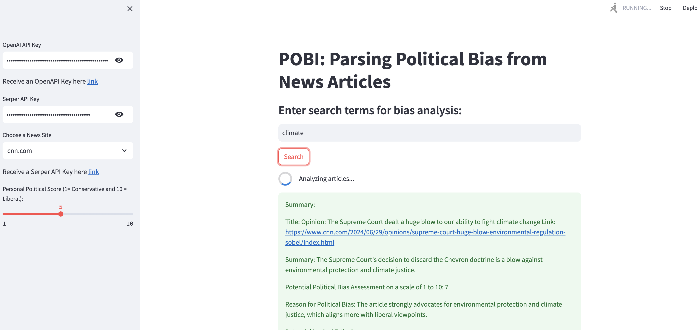

# News Bias Removal Tool (for AGI House RAG 2.0 Hackathon)

## Introduction

The News Bias Analyzer is a powerful tool designed to parse and assess political bias in news articles. In an era of information overload and polarized media, understanding the potential biases in our news sources is more critical than ever.

## Why It Matters

1. **Informed Decision Making**: By identifying potential biases, readers can make more informed decisions about the information they consume.
2. **Media Literacy**: Enhances users' ability to critically analyze news content.
3. **Balanced Perspective**: Encourages seeking out diverse viewpoints for a more comprehensive understanding of issues.
4. **Transparency**: Promotes transparency in media by highlighting potential biases that may not be immediately apparent.

## Features

- Analyzes articles from major news outlets
- Provides a political bias score on a scale of 1-10, for users to input their own political stance for personalized analysis
- Identifies potential logical fallacies in the text as well

## Contributing

We welcome contributions! Please see our [Contributing Guidelines](CONTRIBUTING.md) for more details.

## License

[Your chosen license]
This README provides a concise introduction to your News Bias Analyzer app, highlighting its importance and key features. It also includes a reference to the screenshot image (x.png) which will be displayed at the top of the README on GitHub.
Remember to replace the placeholders (like [Instructions on how to use or install the app] and [Your chosen license]) with the appropriate information for your project. Also, ensure that the image file 'x.png' is indeed in the same directory as the README.md file in your GitHub repository for it to display correctly. CopyRetryClaude does not have the ability to run the code it generates yet.Claude can make mistakes. Please double-check responses.
